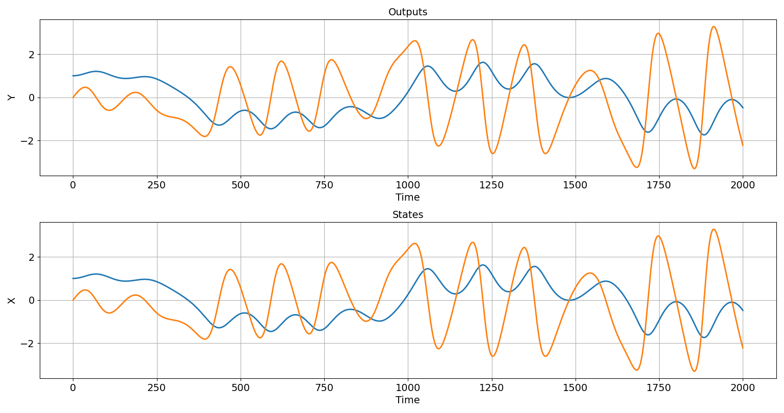
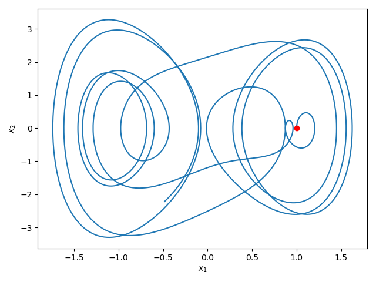

# PSL: Python Systems Library v1.3.1
PSL is a minimalistic library for simulating dynamical systems in Python
using [SciPy](https://scipy.org/) library.

Authors: Jan Drgona, Aaron Tuor, Stefan Dernbach, 
James Koch, Soumya Vasisht, Wenceslao Shaw Cortez, Draguna Vrabie


## 1.3.1 release notes
+ Optional pytorch backend via torchdiffeq for all systems in autonomous.py
+ Faster numpy integration for systems in autonomous.py
+ Sampling of initial conditions and control inputs over dynamic range via get_U, and get_x0 functions for all systems.
+ Coupled dynamical systems in coupled_systems.py module

## Documentation

See online [Documentation](https://pnnl.github.io/psl/).

## Setup

```console
$ conda create -n psl python=3.8
$ conda activate psl
(psl) $ conda install numpy
(psl) $ conda install scipy
(psl) $ conda install matplotlib
(psl) $ pip install pyts
(psl) $ pip install tqdm
```

## Syntax and Use
```python
import psl
# instantiate selected dynamical system model
model = psl.systems['Duffing'](ts=0.01)
# simulate the dynamical system over nsim steps
out = model.simulate(nsim=2000)
# plot time series and phase portrait 
psl.plot.pltOL(Y=out['Y'], X=out['X'])
psl.plot.pltPhase(X=out['Y'])
```




## Examples

See folder [tests](/tests).

